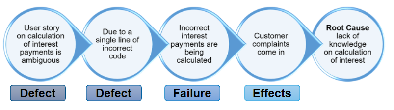

## Module 1 - Fundamentals of Testing
### Identify typical objectives of testing
* verify requirements
* check test object is complete
* build confidence
* prevent defects and failures
* provide information to stakeholders
* make sure product complies with contractual/legal requirements

### Differentiate testing from debugging
* **Testing** - process of finding out if the system has defects 
* **Debugging** - development activity that fixes the defects

### Give examples of why testing is necessary
* Reduce Risk
* Contributes to Quality
* Legal Requirements
* Industry Specific Standards
* Contractual Requirements

### Describe the relationship between testing and qualilty assurance and give examples of how testing contributes to higher quality
Having correct procedures and processes to promote higher quality (quality assurance) and higher quality control (Testing contribute to the overall quality of the product (Quality management).

### Distinguish between error, defect, and failure
**Error** - mistake caused by person
**Defect** - fault/bug in the product caused by the error
**Failure** - incorrect behaviour of the product during execution / run time, caused by a defect

### Distinguish between the root cause of a defect and its effects
Root cause causes an error, leading to a defect, then a failure, then causing effects to the end users. 

### Explain the seven testing principles
1. Testing shows presence of defects, not their absence
2. Exhaustive testing is impossible
3. Early testing saves time and money
4. Defects cluster together
5. Beware of the pesticide paradox
6. Testing is context dependent
7. Absence of errors is a fallacy

### Explain the impact of context on the test process
Contextual factors about the project i.e.
* Internal and external standards
* organisation policies and practices
* operational constraints
* business domain
* product and project risks
* test levels and test types

All influence the test process as they help guide the decision making process on determining what the best testing approach is, to facilitate the contextual conditions. 

### Describe the test activities and respective tasks within the test process
Test Stage | Explanation 
--- | --- 
Planning | defining objectives and approach to meet objectives
Analysis | determine **what to test** in terms of measurable coverage criteria
Design | determine **how to test** by designing test case structure
Implementation | getting everything in place needed to run the test 
Execution | running the test suites created
Completion | gather/process data and results from execution + raise change requests for defects that remain unresolved 

### Differentiate the work products that support the test process
Test Product Type | Examples
--- | --- 
Planning |  Test plans
Monitoring | Test reports
Analysis | Defined and prioritised test conditions, test charters
Design | Design of test cases, test environment, test data, infrastructure and tools
Implementation | Test execution schedule, test suites, test procedures
Execution | Test case statuses, defect reports
Completion | Test summary reports

### Explain the value of maintaining traceability between the test basis and the test work products
Provides more contextual information about the tests that help with the overall autiting process. 

### Identify the psychological factors that influence the success of testing
The level of open-mindedness of both the testers and developers influence the success of testing. Cognitive biases such as confirmation bias can make the testing process more difficult.

### Explain the differece between the mindset required for test activities and the minset required for development activities
Developers - how can I make it?
Testers - how can I brake it?

---

## Module 2 - Testing and the Software Development Lifecycle

### Keywords
Test Levels
: Groups of test activities that are organised and managed together, and include component / integration / system / acceptance testing (which part of the software system)

Test Types
: Functional / Regression (change) / Structural / Non-functional (characteristics / measures of quality)

### Learning Objectives
#### Explain the relationships between software development activities and test activities in the software development lifecycle
- for each development activity in a lifecycle, there is a corresponding test activity
- each test level has test objectives specific to that level
- analysis and design of tests begin during the corresponding development activities
- testers still involved in development process - design, requirements and review

#### Identify reasons why software development lifecycle models must be adapted to the context of project and product characteristics
- Difference in product risks of systems (complex vs simple project)
- Timespan to deliver a product to market (short vs long timespan)

#### Compare the different test levels from the perspective of objectives, test basis, test objects, typical defects and failures and approaches and responsibilities

##### Component Testing 

Focuses on components that are separately testable

##### Integration Testing

Focuses on interactions between components or systems

##### System Testing

Focuses on behaviour and capabilities of a whole system or product, considering 
* end to end tasks
* non-functional behaviours of tasks

##### Acceptance testing
Focuses on user needs, requirements and business processes and that the system satisfies acceptance criterias - whether the user / stakeholder accepts the system
* User acceptance Testing
* Operational Acceptance Testing
* Contract & Regulatory Acceptance Testing
* Alpha & Beta Testing

#### Compare functional, non-functional, and white-box testing
##### Functional Testing
Tests that Evaluate functions that the system should perform. 

##### Non-Functional Testing
Tests measuring the characteristics of systems (how well system behaves) that can be quantified on a varying scale e.g response time for performance testing.

##### White-box Testing
Tests based on the system's internal structure or implementation. 

#### Recognise that functional, non-functional, and white-box tests occur at any test level
Component, Integration, System and Acceptance tests can include any of functional, non-functional and white box test types. 

#### Compare the purposes of confirmation testing and regression testing
Change-related testing
: Tests made for changes in a software system - refactoring, new functionalities etc.
##### Confirmation Testing
Tests that confirm a defect has been successfully fixed. Test cases are the ones that failed because of the defect. 

##### Regression Testing
Repeated testing of an already succesfully tested program, after modification. 

#### Summarise triggers for maintenance testing
- Modification 
    * enhancements to system
    * patches for defects and vulnerability
    * changes to operational environment
- Migration 
    * moving platforms
    * migration of data
- Retirement
    * testing of data migration / archiving

#### Describe the role of impact analysis in maintenance testing
Impact Analysis
: evaluates changes that were made for a maintenance release

- can be done before change is made, to help decide if the change should be made or not

---
## Module 3 - Static Testing

### Recognise types of software work product that can be examined by the different static testing techniques
Almost any software product: 
* Specifications, user stories, architecture, code, testware, user guides, web pages, contracts, project plans, schedules, budget planning, configuration setup, infrastructure setup, models

### Use examples to describe the value of static testing
* Detect and correction of defects earlier
* Find defects that not easily found by dynamic testing
* Prevent issues in requirements from causing issues in any further stage
* Increase development productivity by reducing time and cost
* Testing time and cost reductions
* Reduce total cost of quality over softwares lifetime

### Explain the difference between static and dynamic techniques, considering objectives, type of defects to be identified, and the role of these techniques within the software life cycle
Static testing involves finding defects within the work products directly, where dynamic testing is finding defects through seeing the failures that occur when the test is run.
Static testing can help fix internal issues, while dynamic focuses on fixing the external visible behaviours.

### Summarise the activities for the work product review process

#### Planning
Defining what is going to be reviewed, the people involved and setting up the criteria.

#### Initiate Review
* distributing work product
* explaining the objectives to participants
* answer participant questions

#### Individual Review
* Reviewing the work product
* noting defects recommendations and questions

#### Issue Communication and Analysis
* communicate identified defects
* analyse defects, assign status to them
* evaluation against exit criteria to make review decision

#### Fixing and Reporting
* create defect report
* fix the defects
* communicate defects
* making sure exit criteria is met

### Recognise the different roles and responsibilities in a formal review
* Author
* Management
* Facilitator / Moderator
* Review Leader
* Reviewers
* Scribe / Recorder

### Explain the difference between different types of review: informal review, walkthough, technical review, and inspection
The strictness of each review process increases from left to right. 

#### Informal Review
Review process not based on a formal process, used to detect potential defects. 

#### Walkthrough
Going through the product with the product **author** to find defects, improve software product, and evaluate conformance to standards and specifications.

#### Technical Review
Review done by technical peers / experts in the same or other discipliens to the author. Purpose is to gain consensus, and detect potential defects.

#### Inspection
Strict review led by a trained facilitator. Author has little involvement. Follows a defined process with formal documented outputs.
- detect defects, root cause analysis

### Apply a review technique to a work product to find defects
#### Review Techniques
* Ad hoc
* checklist-based
* scenarios and dry-runs
* perspective-based
* role based

### Explain the factors that contribute to a successful review
#### Organisational success factors
- clear objectives for reviews
- review techniques suitable
- adequate time allocated
- management supports review process
- reviews integrated into companies quality policies

#### People related success factors
- the right people are involved
- participants dedicate adequate time and attention to detail
- reviews conducted on small chunks
- defects found are acknowledged, appreciated, and handled objectively
- trust in atmosphere
- good body language
- adequate training provided
- culture of learning and process improvement

---

## Module 4 - Test Techniques

### Test Techniques
Black Box Testing 
: Seeing that data inputs match expected results.

White Box Testing 
: Testing all the possible decision pathways by considering the internal structure of the component/system being tested.

Experience based testing
: Getting the experience of developers, testers and users to design, implement and execute tests. Typically combined with black and white test techniques.

### Black-box Test Techniques
#### Equivalence Partitions/Classes
> Why repeat tests?

Breaking up test input into "partitions/classes", where each partition is a set of inputs that all have the same expected behaviour.

#### Boundary Value Analysis
> Behaviour at critical points

Using the equivalence partitions, boundary value analysis adds tests cases that includes the data inputs that belong at the transition points between one partition and the next.

##### Two Point BVA
Boundary value inputs include the two values where the partitions change.

##### Three Point BVA
Boundary value inputs include the three values where the partitions change.

#### Decision Table Testing
Testing the different combinations of conditions (inputs) and actions (outputs). 

- TC - Test case
-  C - conditions
-  A - Actions (expected outputs)

#### State Transition Testing
Tests that verify correct system states as they transition from events. 

##### State transition diagram

##### State table

#### Use Case Testing
Testing the different use case scenarios 
* Preconditions 
* Interactions 
* Post Conditions

### White-box Test Techniques
Tests the internal structure of the components. 

#### Statement Testing
Tests the executable statements in the code. 

#### Decision Testing
Tests all possible executable variations in code (if statements). 

### Experience Based Testing 
Testing based off the experience of users, developers and testers.

#### Error Guessing
Guessing potential errors as a tester based off experience.
- common developer mistakes
- issues with system in the past
- common failures with other similar applications

#### Exploratory Testing
Informal testing done to learn more about how to test a system / how it works, when other methods are not feasible. 

#### Checklist-based Testing
Executing tests found in a checklist.

---

## Module 5 - Test Management

### Test Organisation 

#### Independent Testing

Testing software independently, with the degree of independence determined by how separated the tester is to the people / organisation related to the creation of the test product.

#### Levels of Test Independence
- No independence testers 
- .... 
- Independent testers external to the organisation

#### Benefits and Drawbacks of Independence
- Benefits: different perspectives, less business/political bias
- Drawbacks: seperated from the development team / have to learn the system / developers lose sense of responsibility for quality

#### Role of Test Managers
- Manage the testing process, from planning to execution and maintenance. 
- Sometimes this role is delegated to the agile team (delegation dependend on context i.e. SLDC)

#### Role of Testers
- Type of tester dependent on what is being tested / risks and SDLC
- carry out testing tasks i.e. data collection, writing test code, executing tests...

### Test Planning and Estimation

#### Test Planning 
- outline of the test activities
- dependent on the test strategy / policy / SDLC
- a continuous activity occuring throughout the SDLC - adaptation to continuous feedback

#### Test strategies
* **Analytical** - e.g. test prioritised based on level of risk
* **Model Based** - test based on some sort of model for success
* **Methodical** - systematic use of some predefined set of test
* **Process-compliant** - test based on external rules / regulations
* **Directed** - testing driven by guidance of stakeholders / users etc.
* **Regression Averse** - testing to avoid regression - use of automated regression test
* **Reactive** - testing by reacting to the events during test execution 

#### Entry Criteria
Defining when it is okay to go ahead with a test, dependent on availability of:
* testable requirements
* test items that have passed previous levels
* test environment
* test tools
* test data / other resources

#### Exit Criteria
Defining when the testing is done, dependent on: 
- whether tests have executed
- coverage
- defects within a limit
- estimated remaining defects low
- non-functional requirements are sufficient

#### Test execution schedule
Defining in what order/when the tests will be run, dependent on 
- priorities
- dependencies
- confirmation tests
- regression tests
- most efficient sequence

#### Test Effort Factors
* Characteristics of the
    * product
    * development process
    * people

* Test Results

#### Test Estimation 
* Metrics Based
    - Use metrics from previous projects that are similar and can be compared to 

* Expert Based
    - When there are no previous metrics to use
    - Use opinions from people related to the test product i.e. manager/developer/testers

#### Estimation challenges
Estimates can change, due to delays and changes in anciticipated conditions.

### Test Monitoring and Control

**Monitoring** - To assess test progress - i.e. exit/entry criterias, and provide feedback and visibility.

**Control** - any guiding or corrective actions taken in response to changing conditions

### Test Metrics
Different ways of measuring the performance of the test. 
Some test metrics: 
* text case execution - no. of test cases passed/failed
* cost of testing
* test coverage of requirements

### Test Reporting
A report on how the test went.
Includes test summary report - the final report on all the testing.

### Configuration Management
Keeping track of all your test artefacts, its changes i.e. version control

### Risk and Testing
Testing aims to minimize the risk of the product having errors. 

### Defect Management

#### Defects
Discrepencies between actual and expected results during execution, caused potentially by: 
* Design
* Documentation
* Programming
* Testware
* Environment
* Hardware

#### Defect Reports
Details about the defect from dynamic testing.

--- 

## Module 6 - Tool Support for Testing

### Module Content
- **Test Tool Considerations**
- **Effective Use of Tools**

### Classify test tools according to their purpose and the test activities they support
Tool types - tool support for ... 
* managing testing and testware
    * Test management tools
    * Requirements management tools
    * Defect management tools
    * Configuration management tools (version control)
    * Continuous integration tools
* static testing
    * Tools that help enforce coding standards without program execution.
* test design and implementation
    * Model based testing tools
        * help with modelling test strategies i.e. equivalence partitioning, decision trees
    * Test Data preparation tools
        * help with the creation of the data, transferral of data etc.
* test execution and logging
    * Test execution tools
        * execute the tests, logs the results (success/fail)
    * Coverage tools
        * tools that show level of code/requirements covered
    * Test harnesses
        * help with simulating the test environment / missing components
* performance measurement and dynamic analysis
    * performance testing tools
        * tools that put system into simulated load, and shows how well software can handle it
    * dynamic analysis tools
        * provide information during the test execution
        * e.g. pointer values / memory allocations / memory leaks
* specialized testing needs
    * for non functional requirements
        * data quality
        * usability, accessibility
        * localization
        * security
        * portability

### Identify benefits and risks of test automation
<u>Benefits</u>
* reduce repetition
* increase consistency + repeatability
* reuce bias - more objective assessment

<u>Risks</u>
* Issues with the tool vendor
* Relying too much on the tool
* Underestimating / neglecting the time needed to setup/learn the tool
* Management/testers having unrealistic expectations for the tool 

### Remember special considerations for test execution and test management tools
<u> Considerations for test execution tools </u>
* different approaches
    * capturing test approach
        * where you automate tests captures from manual testing
    * Data driven approach
        * genericising the test process by allowing different types of data to be applied on the same test
    * keyword driven approach
        * specific keywords determine how code is tested

<u> Considerations for test management tools </u>
* need to interface with other tools or spreadsheets
    * need to produce information for organisation
    * maintain consistent traceability to requirements
    * link test object version information via configuration measurement tool 

### Identify the main principles for selecting a tool 
* maturity of organisation 
* evaluation of the vendor / free trial period / Licensing models
* Internal training needs
* tool compatability

### Recall the objectives for using pilot projects to introduce tools
* Gain knowledge
* Evaluate fit with current processes and practices
* Decide on standards
* Assess if benefits will be achieved
* Determine metrics and configuration

### Identify the success factors for evaluation, implementation, deployment, and on-going support of test tools in an organisation
* Rolling out the tool incrementally 
* Adapting and improving processes to fit
* defining guidelines for use of the tool 
* Implementing a way to gather usage information about actual use of the tool
* Monitoring tool use and benefits
* providing support to the users of a given tool 
* gathering lessons from all users

verification and validation